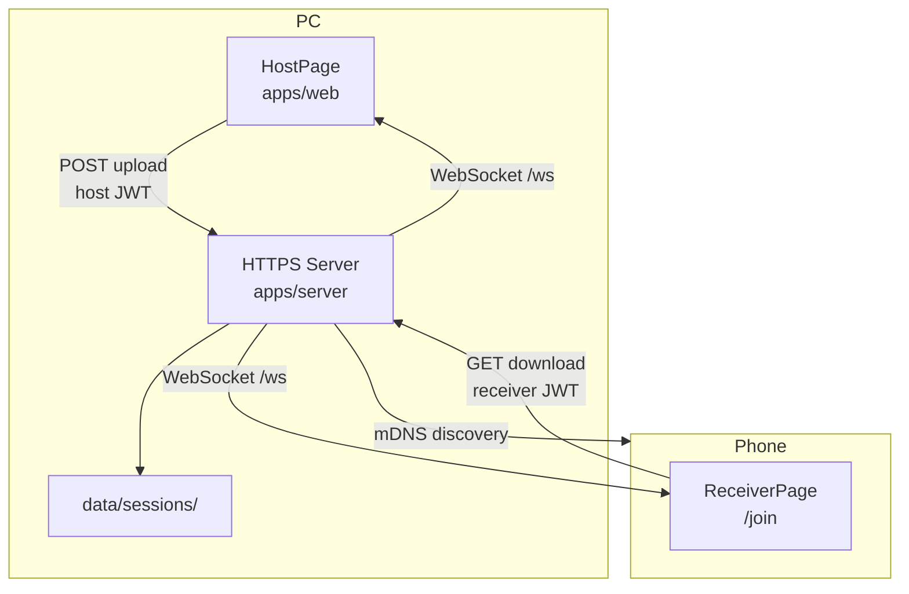
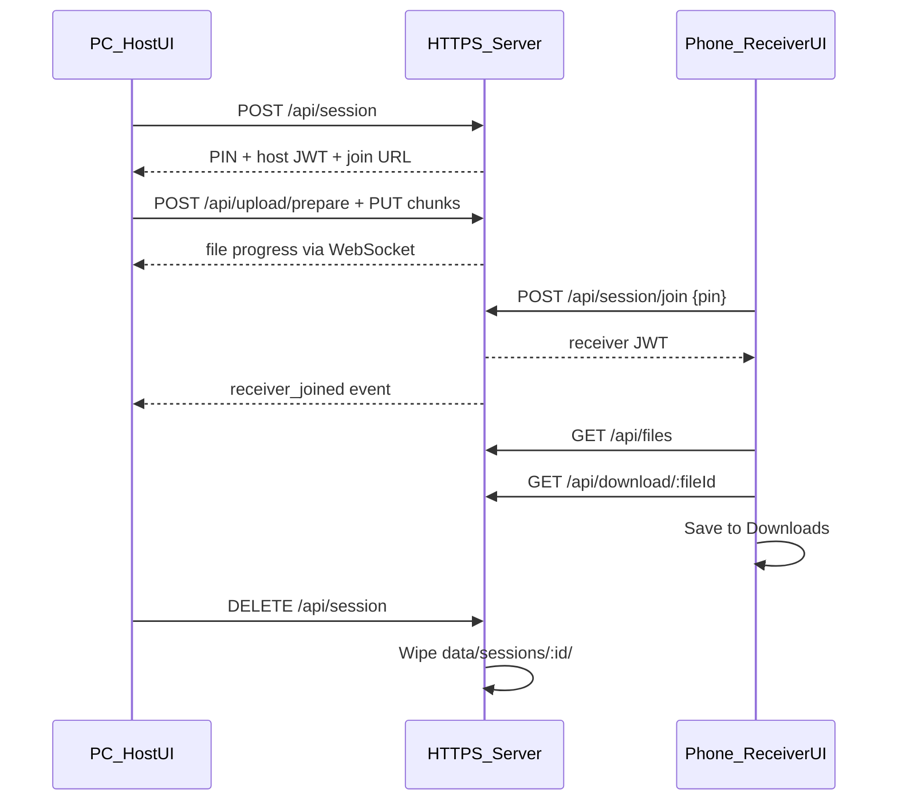

# Architecture

This document explains how Transfer File is structured and how data flows from the PC to the phone over your local network.

## Purpose

Transfer File solves one problem: **send files from a PC to a phone over LAN without using the internet or mobile data**. The PC runs a local HTTPS server. The phone opens a browser, enters a PIN, and downloads files. Upload direction is **PC → phone only** in v1.

## High-level overview



## Monorepo layout

```
TRANSFER_FILE/
├── apps/
│   ├── server/          # Node.js + Hono HTTPS API, WebSocket, mDNS
│   │   └── src/
│   │       ├── index.ts           # Boot: TLS, HTTPS, WebSocket, mDNS
│   │       ├── config.ts          # Env vars, LAN IP detection
│   │       ├── routes/app.ts      # REST API routes
│   │       ├── services/          # Session, file store, auth, discovery
│   │       └── middleware/auth.ts # JWT + LAN-only checks
│   └── web/             # React + Vite frontend
│       └── src/
│           ├── pages/HostPage.tsx      # PC: upload, QR, PIN
│           ├── pages/ReceiverPage.tsx  # Phone: PIN entry, download
│           └── api/client.ts         # HTTP client, chunked upload
├── packages/
│   └── shared/          # Zod schemas, shared types, constants
│       └── src/schemas.ts
└── data/                # Runtime data (gitignored)
    ├── certs/           # Auto-generated TLS certificate
    └── sessions/        # Ephemeral uploaded files
```

## Server boot sequence

When you run `npm start` or `npm run dev`, [`apps/server/src/index.ts`](../apps/server/src/index.ts) performs:

1. **Load `.env`** — JWT secret, port, LAN settings
2. **Ensure TLS credentials** — generate or load self-signed cert in `data/certs/`
3. **Create Hono app** — register REST routes via `createApp()`
4. **Attach static file serving** — serve built web UI from `apps/web/dist`
5. **Start HTTPS server** — listen on `0.0.0.0:8787` (configurable)
6. **Attach WebSocket** — `/ws` for real-time progress events
7. **Start mDNS** — advertise `transfer-file` service on the LAN
8. **Print URLs** — localhost, LAN IP, join URL, TLS fingerprint

## Session lifecycle



| Phase | What happens |
|-------|--------------|
| **Create** | Host opens UI → `POST /api/session` → 6-digit PIN generated, host JWT issued |
| **Upload** | Host drags files → metadata registered → 2 MiB chunks streamed to disk |
| **Join** | Phone scans QR → enters PIN → receiver JWT issued |
| **Download** | Phone lists files → streams each file via `GET /api/download/:fileId` |
| **End** | Host clicks "End session" → files deleted from disk, `session_ended` broadcast |

Only **one active session** exists at a time. Creating a new session wipes the previous one.

## File transfer hot path

### Upload (PC → server)

1. Host selects files in [`FileDropzone`](../apps/web/src/components/FileDropzone.tsx)
2. Client calls `POST /api/upload/prepare` with filename and size
3. Client slices file into **2 MiB chunks** (`CHUNK_SIZE_BYTES` in `packages/shared`)
4. Each chunk sent via `PUT /api/upload/:fileId` with optional `Content-Range` header for resume
5. Server writes chunk to `data/sessions/<sessionId>/<fileId>_<filename>` via [`FileStore`](../apps/server/src/services/file-store.ts)
6. WebSocket broadcasts `file_progress` and `file_ready` events

Files are **never fully buffered in RAM** on the server. Each chunk is written to disk immediately.

### Download (server → phone)

1. Receiver calls `GET /api/download/:fileId` with receiver JWT
2. Server streams file from disk using Node `createReadStream` → Web `ReadableStream`
3. Phone client reads response body in chunks, assembles a `Blob`, triggers browser download

### Limits (defaults)

| Constant | Value | Location |
|----------|-------|----------|
| Max file size | 10 GB | `MAX_FILE_SIZE_BYTES` |
| Max files per session | 100 | `MAX_FILES_PER_SESSION` |
| Chunk size | 2 MiB | `CHUNK_SIZE_BYTES` |
| Session TTL | 24 hours | `SESSION_TTL_MS` |

## Authentication and roles

Two JWT roles exist, embedded in token claims:

| Role | Issued to | Can do |
|------|-----------|--------|
| `host` | PC browser on session create | Upload files, end session, list files |
| `receiver` | Phone after PIN verify | List files, download files only |

Upload routes use `hostAuth` middleware. Download routes use `receiverAuth`. A receiver token calling upload endpoints receives **403 Forbidden**.

## Web UI routing

[`apps/web/src/App.tsx`](../apps/web/src/App.tsx) routes by hostname:

| URL | Hostname | Page |
|-----|----------|------|
| `/` | `localhost` or `127.0.0.1` | HostPage (upload + QR + PIN) |
| `/` | LAN IP (e.g. `192.168.1.5`) | Redirect to `/join` |
| `/join` | Any | ReceiverPage (PIN + download) |

In development (`npm run dev:all`), Vite runs on port 5173 and proxies `/api` and `/ws` to the HTTPS server on port 8787.

## Real-time updates (WebSocket)

All connected clients subscribe to `/ws`. Events are defined in [`packages/shared/src/schemas.ts`](../packages/shared/src/schemas.ts):

| Event | When fired | Payload |
|-------|------------|---------|
| `file_added` | Upload metadata registered | `{ file: FileMeta }` |
| `file_progress` | Chunk uploaded | `{ fileId, uploadedBytes, totalBytes }` |
| `file_ready` | Upload complete | `{ file: FileMeta }` |
| `file_failed` | Upload error | `{ fileId, error }` |
| `receiver_joined` | Phone entered correct PIN | `{ sessionId }` |
| `session_ended` | Host ended session | `{ sessionId }` |

## Network discovery

- **LAN IP** — detected from OS network interfaces; prefers `192.168.x.x`, `10.x.x.x`, `172.16–31.x.x`
- **mDNS** — `bonjour-service` publishes `_transfer-file._tcp` on port 8787
- **QR code** — encodes the join URL (`https://<lan-ip>:8787/join`) for easy phone access

## What is not in v1

- Phone → PC upload (receiver is download-only)
- Internet/cloud relay
- WebRTC peer-to-peer transfer
- Rate limiting on API endpoints (planned, not yet implemented)
- System tray / auto-start desktop wrapper
- PWA offline install

See [Architecture Decision Records](decisions/) for rationale behind these scope choices.
